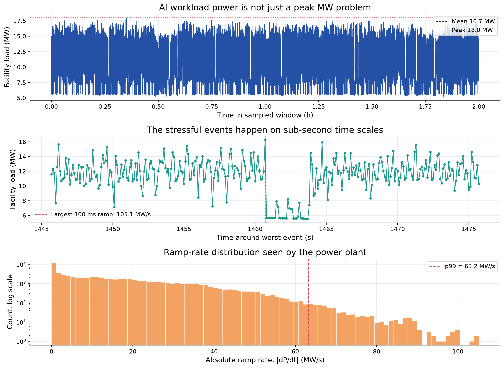
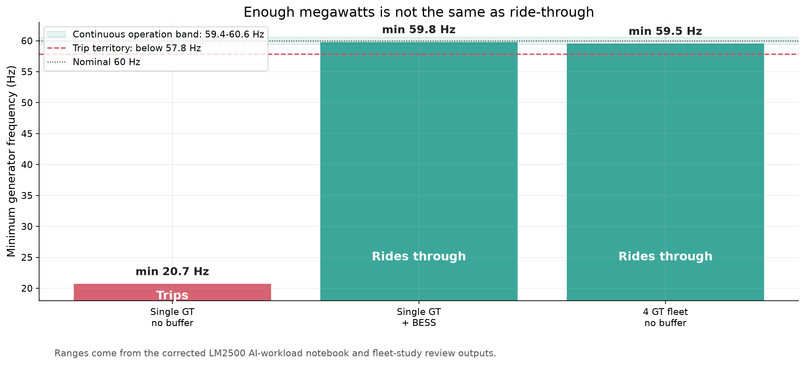
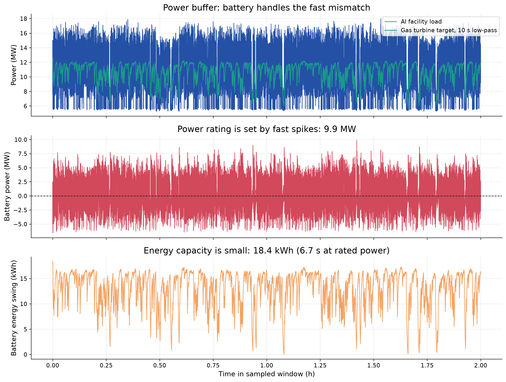
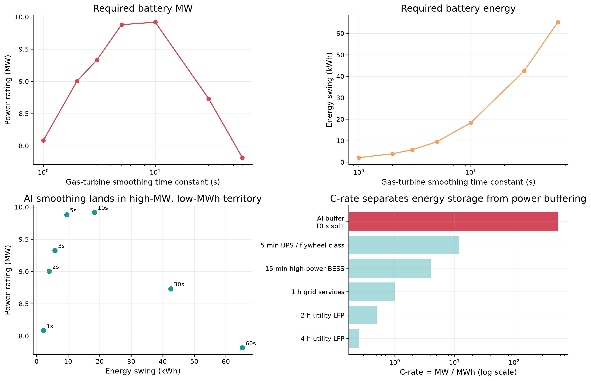
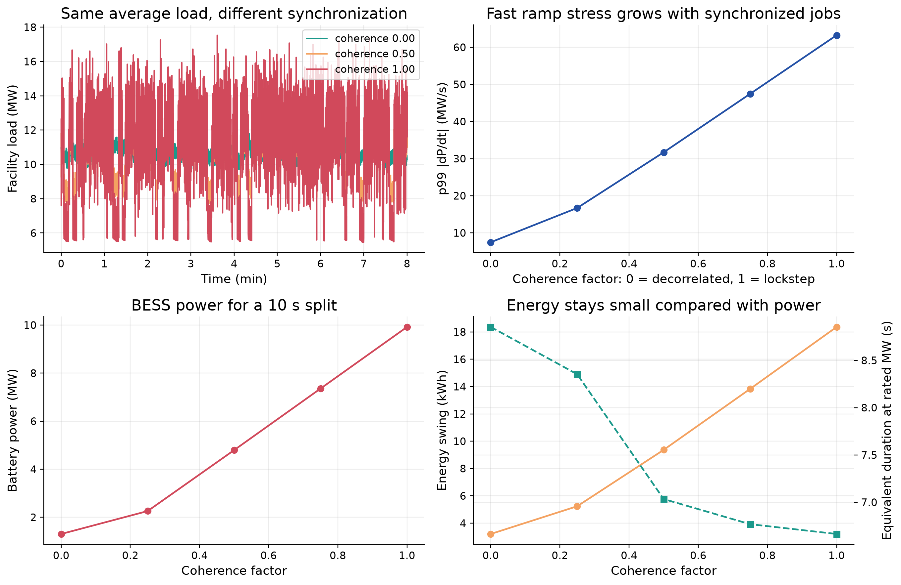
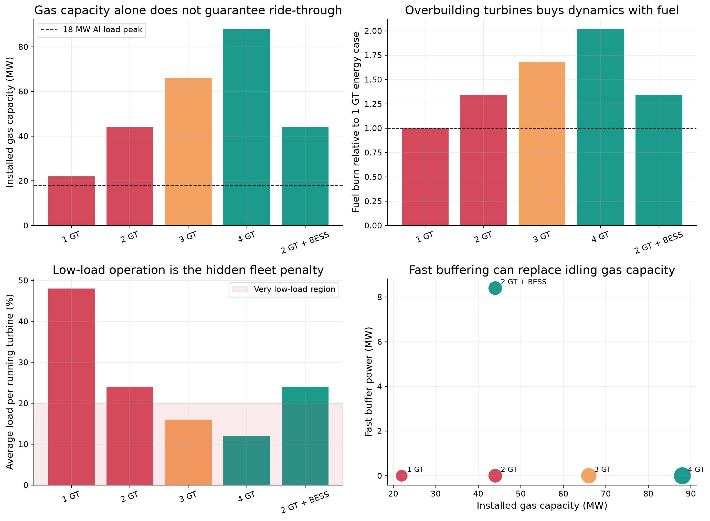
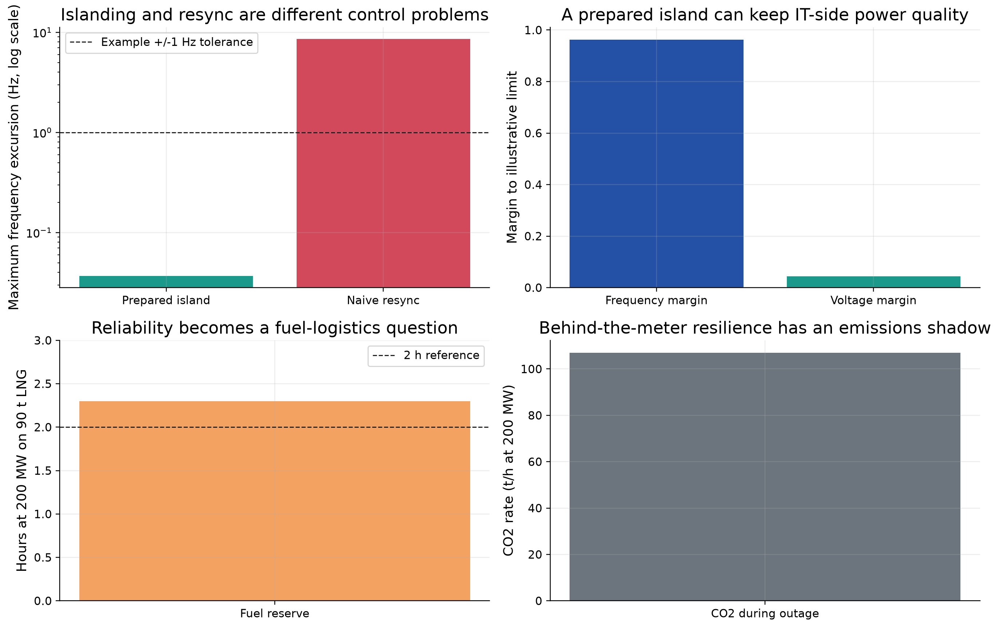
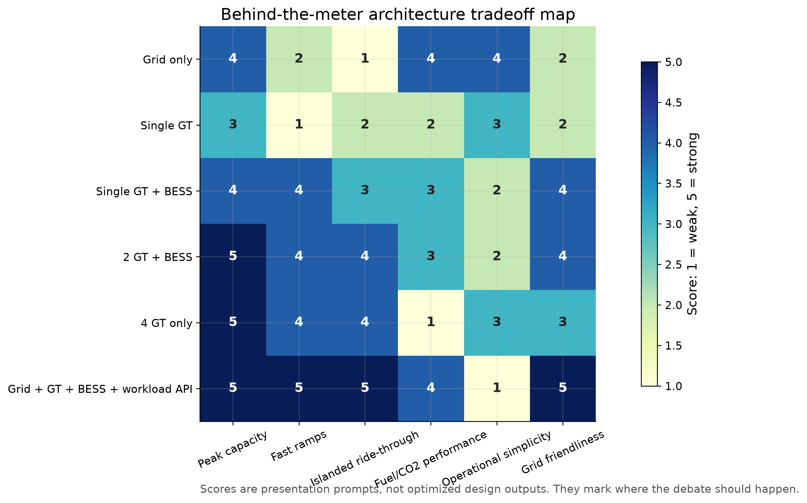

# Who Powers Intelligence?

## Behind-the-meter generation, AI data centers, and the hidden dynamics problem

Broad-audience rough deck generated from the DataCenter research repo.

---

# The Core Question

AI power discussions often start with one number: **How many megawatts?**

This deck asks a more awkward question:

**Can the proposed power system follow the AI load fast enough to keep operating?**

That brings turbines, batteries, grid ties, software schedulers, fuel logistics, and emissions into the same conversation.

---

# Big Idea

Behind-the-meter generation does not make a data center independent from power-system physics.

It changes who owns the physics:

- The data-center operator
- The turbine and battery controls
- The utility interconnection agreement
- The AI workload scheduler
- The emissions and fuel-supply plan

---

# AI Load Is Not Just Peak MW



---

# Takeaway

The average load and peak load are not enough.

The stressful events happen when thousands of devices change state together. Those fast ramps can arrive in fractions of a second, much faster than a gas turbine can comfortably follow.

Discussion prompt: **Should large AI campuses have ramp-rate obligations?**

---

# Enough MW Is Not Enough



---

# What This Means In Plain English

A turbine can have enough rated power and still fail the job.

Rated power answers: **Can it eventually supply the load?**

Frequency ride-through answers: **Can it survive the first few seconds while the load changes?**

That second question is the one often missing from casual AI-power discussions.

---

# Power Buffer Vs Energy Storage



---

# The Battery Is A Shock Absorber

In this case, the battery is not mainly storing energy for hours.

It is absorbing and injecting power for seconds while the turbine follows the slower part of the load.

Plain-English distinction:

- MW is how wide the pipe is.
- MWh is how big the tank is.
- AI transients may need a wide pipe more than a huge tank.

---

# Not All Batteries Are The Same



---

# Discussion Point

Most utility-scale batteries are built for roughly 1 to 4 hours.

The AI fast-ramp problem can look like seconds of support at very high power.

That is closer to UPS, flywheel, supercapacitor, or high-power inverter behavior than ordinary long-duration energy shifting.

Question: **Should data-center UPS assets become part of the power-control strategy?**

---

# Synchronization Is The Hidden Variable



---

# Why Correlation Matters

If many independent jobs run at different times, their power swings partly cancel out.

If one huge training job makes thousands of accelerators move together, the facility can act like one giant synchronized load.

Question: **Is the enemy total energy, peak power, or synchronization?**

---

# The Fleet Temptation



---

# More Turbines Help, But Not For Free

More turbines provide more spinning inertia and more total ramp capability.

But running many turbines lightly loaded can waste fuel and increase maintenance exposure.

The interesting design tension:

**A small fast buffer may be cheaper and cleaner than keeping extra turbines spinning at poor part load.**

---

# Islanding Is Only Half The Story



---

# Reconnecting Is Not Just Flipping A Switch

An islanded site can survive if generation and load are prepared.

But reconnecting to the grid requires phase, frequency, and voltage matching. A naive reclose can create a much larger electrical event than the original outage.

Question: **Who owns resynchronization risk for behind-the-meter generation?**

---

# Architecture Tradeoff Map



---

# One Honest Message

None of these physics are new to power engineers.

What is timely is the combination:

- Very large AI loads
- Fast software-driven variability
- Private behind-the-meter generation
- Batteries and UPS already on site
- Flexible workloads that can sometimes wait seconds or minutes
- Public-grid impacts from private infrastructure decisions

---

# Software Becomes A Power-Control Lever

An AI scheduler could expose a power-shaping API:

- Ramp jobs gradually instead of all at once
- Stagger checkpointing
- Delay non-urgent jobs during grid stress
- Respect site ramp-rate limits
- Coordinate with battery state of charge
- Avoid synchronized power shocks

Question: **Should AI training schedulers be part of the energy system design?**

---

# Closing Thought

The AI power question is not only:

**Where will the energy come from?**

It is also:

**Who is responsible for making intelligence electrically well behaved?**

---

# Regeneration Commands

From the repo root:

```bash
pixi run python tools/presentation/run_all.py
```

Individual plotting scripts are listed in `IMPLEMENTATION_NOTES.md`.
